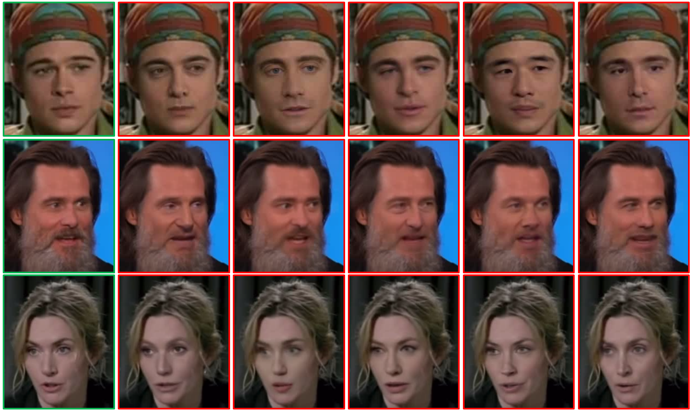
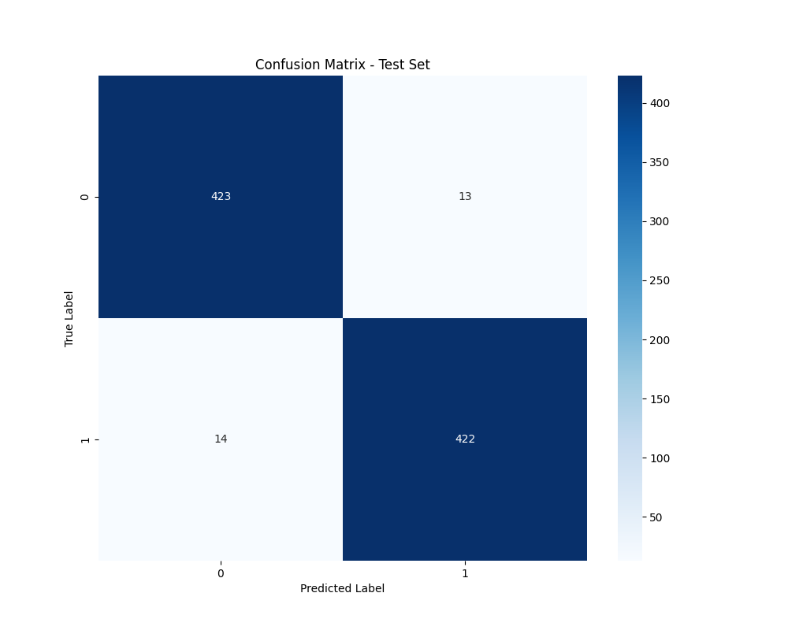
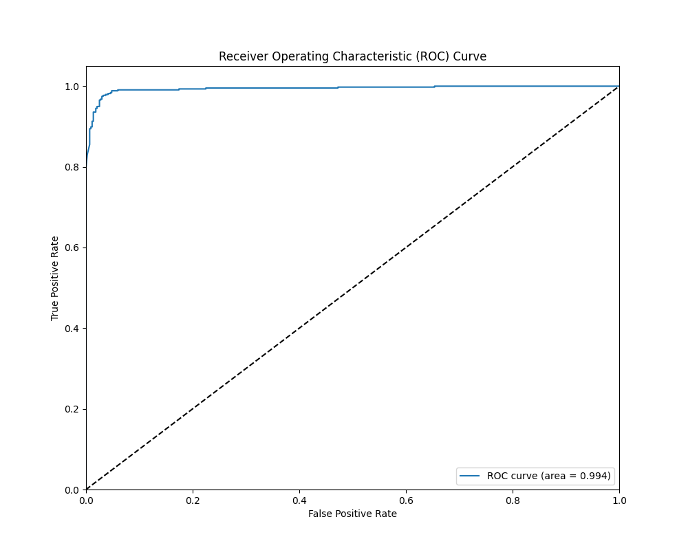

# ResLSTM-DF: Multimodal Deepfake Detection

This project implements a deepfake detection system using the Celeb-DF dataset with a ResNet-LSTM architecture, combining spatial and temporal modalities for robust detection.

## Table of Contents
- [Project Structure](#project-structure)
- [Prerequisites](#prerequisites)
- [Setup](#setup)
- [Dataset](#dataset)
- [Results](#results)
- [Contributing](#contributing)
- [License](#license)

## Project Structure
- `preprocessing/preprocess-celebDF.ipynb`: Data preprocessing script
- `training/train_resnet_lstm.ipynb`: Model training and evaluation script

## Prerequisites
- Google Colab with GPU (T4 recommended)
- Google Drive access
- Python 3.8+
- 16GB+ RAM recommended

## Setup
1. **Clone the Repository**:
   ```bash
   git clone https://github.com/subinchenha/ResLSTM-DF.git
   cd ResLSTM-DF
   ```

2. **Set Up Google Colab**:
   - Upload the notebook files to Google Colab.
   - Mount your Google Drive to access the dataset:
     ```python
     from google.colab import drive
     drive.mount('/content/drive')
     ```

3. **Install Dependencies**:
   Run the following in a Colab cell:
   ```bash
   !pip install opencv-python numpy pandas torch torchvision tqdm sklearn matplotlib seaborn
   ```

4. **Prepare the Dataset**:
   - Download the Celeb-DF dataset (see [Dataset](#dataset) section).
   - Place it in `/content/drive/MyDrive/Celeb-DF`.
   - Run the preprocessing script (`preprocess-celebDF.ipynb`) to generate face clips and metadata.

5. **Train and Evaluate**:
   - Run the training script (`train_resnet_lstm.ipynb`) to train the model and generate evaluation plots.

## Dataset
This project uses the **Celeb-DF dataset**, which contains real and synthesized celebrity videos. Below is a sample of face frames extracted from the dataset:



To use this project, download the Celeb-DF dataset from the official repository:  
[Download Celeb-DF Dataset](https://github.com/yuezunli/celeb-deepfakeforensics)

## Results
The model’s performance is visualized through the following plots:

### Test Confusion Matrix


### ROC Curve



## Contributing
Contributions are welcome! Please:
1. Fork the repository.
2. Create a feature branch (`git checkout -b feature/new-feature`).
3. Commit your changes (`git commit -m "Add new feature"`).
4. Push to the branch (`git push origin feature/new-feature`).
5. Open a pull request.

## License
This project is licensed under the Apache License 2.0 - see the  file for details.

---

